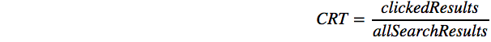
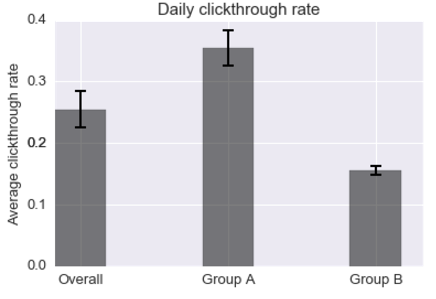
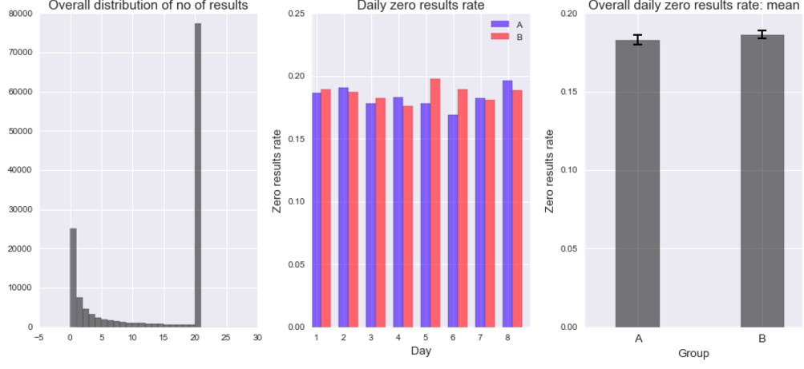
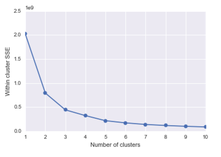
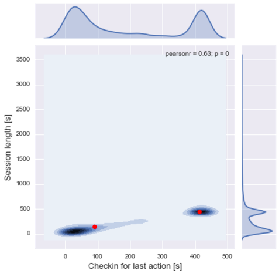

# Wikipedia Users: web analytics

📚 👀 Quick look into behavioral characteristics and usage metrics of Wikipedia users based on event logging (EL) data using Python stack (scikit-learn k-means, seaborn, pandas, numpy and scipy stats) 💻

A lot of companies rely on event logging (EL) to track a variety of performance and usage metrics to help make decisions. In this analysis I dove into one week of Wikipedia users' data to answer the following questions:

**1. What is Wikipedia daily overall clickthrough rate1? How does it vary between the groups A and B?**

1clickthrough rate: the proportion of search sessions where the user clicked on one of the results displayed.

**2. What is Wikipedia's daily overall zero results rate2? How does it vary between the groups?**

2zero results rate: the proportion of searches that yielded 0 results
and other metrics outside the scope of this task. EL uses JavaScript to asynchronously send messages (events) to our servers when the user has performed specific actions. In this task, you will analyze a subset of our event logs.

**3. Let session length be approximately the time between the first event and the last event in a session. Choose a variable from the dataset and describe its relationship to session length. Visualize the relationship.**

I chose to investigate if there is evidence for different browsing behaviors among users. Specifically, I was intrigued by the possibility that there are various browsing styles: quick fact checking (1) and deeper dives into Wikipedia articles (2). 

I verified this hypothesis by looking at the ratio of the duration of the last action performed during browsing session to the duration of the whole session and clustering the user data using unsupervised machine learning algorithm k-means (from the scikit-learn stack). 

When running k-means it is vital to explore various numbers of centroids. One way to do that is to look for "an elbow" in the plot illustrating the number of centroids plotted agains the sum of squared error (SSE) and pick the moment when the drop "looses the momentum". In the case below, it happens after adding the third centroid:

When we plot the centroids on top of a scatter plot of last action duration and the total session lenght we can see that they indeed overlap with increased density of users:

The first user (cluster on the left), who perhaps just wants to quickly check some facts, would have the session lenght pretty much limited to one site, to which s/he arrives after a quick search. The second user (cluster on the right), who wants to spend more time and explore the related articles, would do some jumping between the articles and finally spend most of their time on the very last one. 

This is evidenced by a linear relationship between the session length (y axis) and the duration of the last action (su) and a high correlation (r = .63), which means that users tend to spend most time of their session on the very last website. There are a number of implications for the user interface, such as:

1. So, we have users that already spend a lot of time on Wikipedia (cluster 2). How can we incentivise users from the first cluster to spend more time on Wikipedia? Can we engage them better with the content? 

2. If the users need to find what they are looking for fast and are not willing to spend more time on the website, how can we make their search faster, thus making it more likely they will come back?

These are just example questions which require further investigations and collaboration with the UX team. An example follow-up experiment would involve either running an in-depth study with users on-site or running a large group of participants online. 

