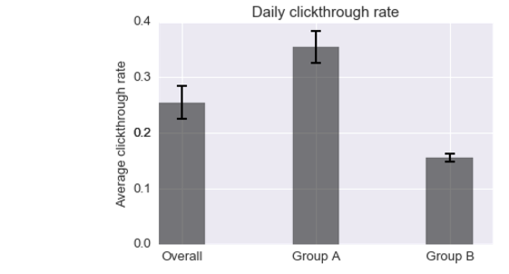
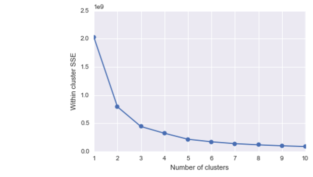

# Wikipedia Users

📚 👀 Quick look into behavioral characteristics and usage metrics of Wikipedia users based on event logging (EL) data using Python stack (scikit-learn k-means, seaborn, pandas, numpy and scipy stats) 💻

A lot of companies rely on event logging (EL) to track a variety of performance and usage metrics to help us make decisions. In this analysis I dove into one week of Wikipedia users' data to answer the following questions:

**1. What is Wikipedia daily overall clickthrough rate1? How does it vary between the groups A and B?**

1clickthrough rate: the proportion of search sessions where the user clicked on one of the results displayed such that 

**2. What is Wikipedia's daily overall zero results rate2? How does it vary between the groups?**

2zero results rate: the proportion of searches that yielded 0 results
and other metrics outside the scope of this task. EL uses JavaScript to asynchronously send messages (events) to our servers when the user has performed specific actions. In this task, you will analyze a subset of our event logs.

**3. Let session length be approximately the time between the first event and the last event in a session. Choose a variable from the dataset and describe its relationship to session length. Visualize the relationship.**

I chose to investigate if there is evidence for different browsing behaviors among users. Specifically, I was intrigued by the possibility that there are various browsing styles: quick fact checking (1) and deeper dives into Wikipedia articles (2). 

I verified this hypothesis by looking at the ratio of the duration of the last action performed during browsing session to the duration of the whole session and clustering the user data using unsupervised machine learning algorithm k-means (from the scikit-learn stack). 

When running k-means it is vital to explore various numbers of centroids. One way to do that is to look for "an elbow" in the plot illustrating the number of centroids plotted agains the sum of squared error (SSE) and pick the moment when the drop "looses the momentum". In the case below, it happens after adding the third centroid:

When we plot the centroids on top of a scatter plot of last action duration and the total session lenght we can see that they indeed overlap with increased density of users:

The first user, who just wants to quickly check some facts, would have the session lenght pretty much limited to one site, to which he arrives after a quick search. The second user, who wants to spend more time and explore the related articles, would do some jumping between the articles and finally spend most of their time on the very last one. 

