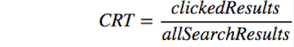

# Wikipedia Users

📚 👀 Quick look into behavioral characteristics and usage metrics of Wikipedia users based on event logging (EL) data 💻

A lot of companies rely on event logging (EL) to track a variety of performance and usage metrics to help us make decisions. In this analysis I dove into one week of Wikipedia users' data to answer the following questions:

1. What is Wikipedia daily overall clickthrough rate1? How does it vary between the groups A and B?
2. What is Wikipedia's daily overall zero results rate2? How does it vary between the groups?
3. Let session length be approximately the time between the first event and the last event in a session. Choose a variable from the dataset and describe its relationship to session length. Visualize the relationship.

1clickthrough rate: the proportion of search sessions where the user clicked on one of the results displayed such that 

2zero results rate: the proportion of searches that yielded 0 results
and other metrics outside the scope of this task. EL uses JavaScript to asynchronously send messages (events) to our servers when the user has performed specific actions. In this task, you will analyze a subset of our event logs.

